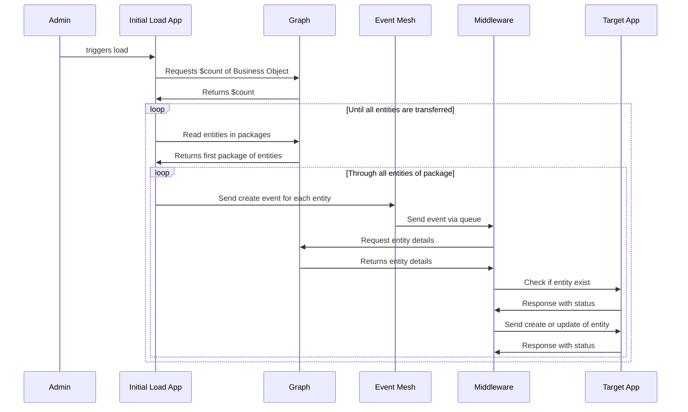

# SAP Event Mesh

Initial data load using SAP Event Mesh



.env Template:

```
XBEM_INPUT_X=ProductCreated
SAP_XBEM_BINDINGS='{
    "inputs": {
        "ProductCreated": {
            "service": "rest-client",
            "address": "queue:sap/rest/client/ProductCreated",
            "reliable": true
        }
    },
    "outputs": {
        "ProductCreated" : {
            "service": "rest-client",
            "address": "topic:sap/S4HANAOD/K8M/ce/sap/s4/beh/product/v1/Product/Created/v1",
            "reliable": false
        },
        "ProductChanged" : {
            "service": "rest-client",
            "address": "topic:sap/S4HANAOD/K8M/ce/sap/s4/beh/product/v1/Product/Changed/v1",
            "reliable": false
        }
    }
}'
VCAP_SERVICES='{
    "enterprise-messaging": [
        {
            "label": "enterprise-messaging",
            "provider": null,
            "plan": "default",
            "name": "rest-client",
            "tags": [
                "enterprise-messaging"
            ],
            "instance_guid": "6a1ca408-e439-4f46-a765-dea57b698064",
            "instance_name": "rest-client",
            "binding_guid": "5978cea2-c341-48dc-bbe6-8b8eb8300c6b",
            "binding_name": null,
            "credentials": {
            },
            "syslog_drain_url": null,
            "volume_mounts": []
        }
    ]
}'
```
